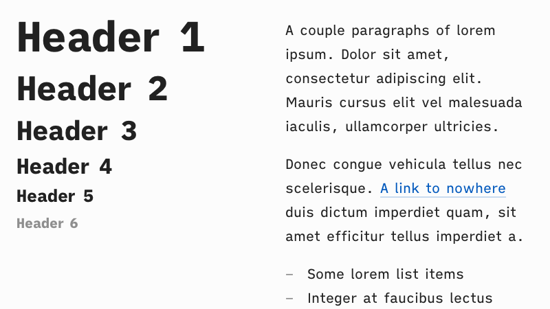
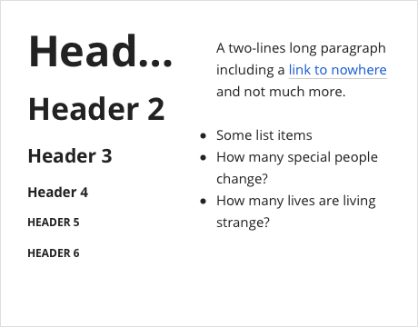
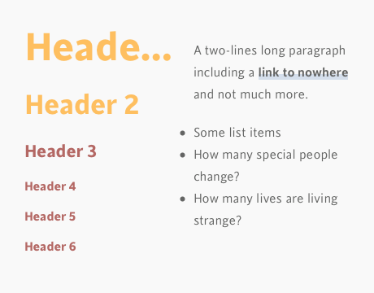
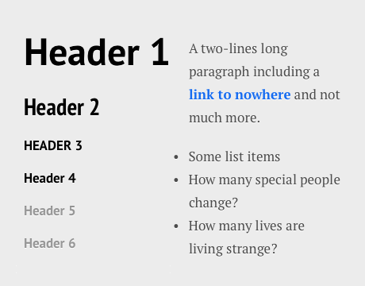

# Markdown Utilities

## Markdown Setup

[Atom](https://atom.io/) for editing, along with the excellent [Marked](https://marked2app.com/) for rendering.
[TableFlip](TableFlip) for table-heavy documents.

Atom setup:

- [Hypest](https://hector.me/hypest-atom) UI and syntax themes
- [document-outline](https://atom.io/packages/document-outline), [folding-markdown](https://atom.io/packages/folding-markdown), [markdown-table-editor](https://atom.io/packages/markdown-table-editor), [smart-quotes-plus](https://atom.io/packages/smart-quotes-plus), [wordcount](https://atom.io/packages/wordcount) packages
- Personal prefs: disable `tree-view` package, set `Editor/Tab Length` to `4`

## Stylesheets

### Installation

Adding the stylesheets to Marked: `Marked 2` → `Preferences` → `Style`.

The stylesheets haven't been tested in other tools. However they're generic CSS and could be reused elsewhere, provided the Marked-specific `#wrapper` selectors are removed.

### Gallery

**Tetra**  
High legibility, low strain style for long-form reading. Supports high contrast mode. Fonts: [iA Writer Mono](https://github.com/iaolo/iA-Fonts/tree/master/iA%20Writer%20Mono), [iA Writer Mono](https://github.com/iaolo/iA-Fonts/tree/master/iA%20Writer%20Quattro), both free.

**UXASF1**  
Run-of-the-mill sans-serif style, with big text baseline and even bigger titles. Used to render [UXA documents](https://github.com/nWODT-Cobalt/uxa). Supports high contrast mode. Fonts: [Inter](https://rsms.me/inter/) and [iA Writer Mono](https://github.com/iaolo/iA-Fonts/tree/master/iA%20Writer%20Mono), both free.  

Older stylesheets, not updated since 2015 ↓

**Godspeed** (with free [Source Sans](https://fonts.google.com/specimen/Source+Sans+Pro) and paid [Brush Up Too](https://www.myfonts.com/fonts/pintassilgo/brush-up/too/))  

**New Modern** (with free [Open Sans](https://fonts.google.com/specimen/Open+Sans))  

**Torpedo** (with free [Open Sans](https://fonts.google.com/specimen/Open+Sans) and paid [Cinta](https://www.myfonts.com/fonts/tipo-pepel/cinta/))  

**Vostok** (with free [PT Serif, PT Sans and PT Sans Narrow](https://company.paratype.com/pt-sans-pt-serif))  

**Table of Figures**  
Display only the images of the current document.

**Table of Tables**  
Display only the tables of the current document.

## Resources

Sample documents for development and testing.

- `Short Specimen`: sample document of common Markdown tags; used to make the previews for this readme
- `Long Specimen`: sample document of almost all MultiMarkdown tags, for more exhaustive work. The first half prints tags for completeness check, the second one prints long form text for typographic rythm check.

Previews are processed (e.g. cropped) in a [private Figma document](https://www.figma.com/file/lLZWGpxAc71dB5p8mI8Lkn/Markdown-Utilities).
