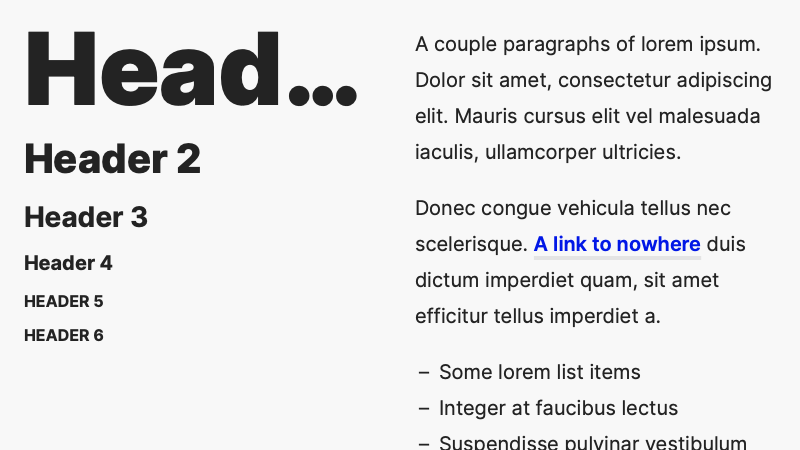

# Markdown Utilities

## Markdown Setup

[Atom](https://atom.io/) for editing, along with the excellent [Marked](https://marked2app.com/) for rendering.
[TableFlip](TableFlip) for table-heavy documents.

Atom setup:

- [Hypest](https://hector.me/hypest-atom) UI and syntax themes
- [document-outline](https://atom.io/packages/document-outline), [folding-markdown](https://atom.io/packages/folding-markdown), [smart-quotes-plus](https://atom.io/packages/smart-quotes-plus), [wordcount](https://atom.io/packages/wordcount) packages
- Personal prefs: disable `tree-view` package, set `Editor/Tab Length` to `4`

## Stylesheets

Custom CSS style for Marked. Could be reused elsewhere, provided `#wrapper` selectors are removed.

**UXASF1**, with free [Inter](https://rsms.me/inter/). Used to render [UXA documents](https://github.com/nWODT-Cobalt/uxa).  

Older stylesheets, not updated since 2015 ↓

**Godspeed** (with free [Source Sans](https://fonts.google.com/specimen/Source+Sans+Pro) and paid [Brush Up Too](https://www.myfonts.com/fonts/pintassilgo/brush-up/too/))  

**New Modern** (with free [Open Sans](https://fonts.google.com/specimen/Open+Sans))  

**Torpedo** (with free [Open Sans](https://fonts.google.com/specimen/Open+Sans) and paid [Cinta](https://www.myfonts.com/fonts/tipo-pepel/cinta/))  

**Vostok** (with free [PT Serif, PT Sans and PT Sans Narrow](https://company.paratype.com/pt-sans-pt-serif))  

**Table of Figures**

Display only the images of the current document.

**Table of Tables**

Display only the tables of the current document.

## Specimens

Sample documents for development and testing.

- `Short Specimen.md`: common Markdown tags; used to make the previews for this readme
- `Long Specimen.md`: almost all MultiMarkdown tags, for more exhaustive work

Previews are processed (e.g. cropped) in a [private Figma document](https://www.figma.com/file/lLZWGpxAc71dB5p8mI8Lkn/Markdown-Utilities).
