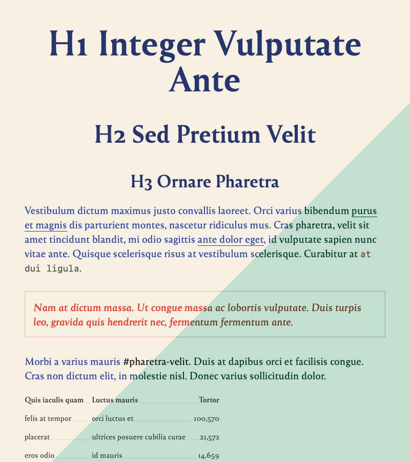
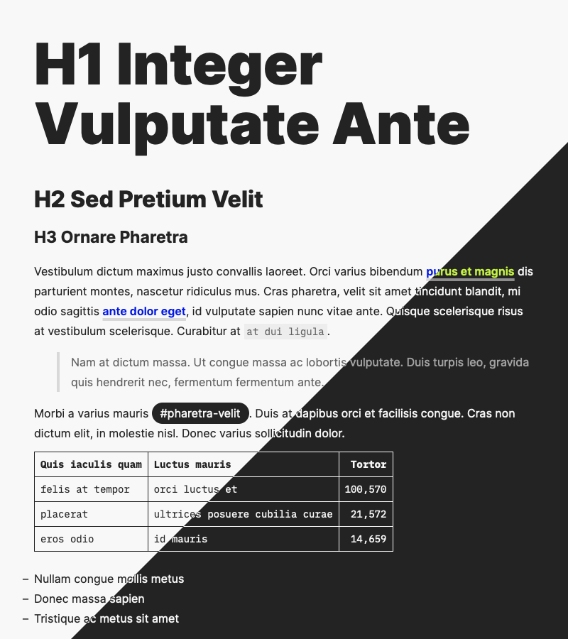

# Markdown Utilities

Tools for editing, rendering and exporting Markdown files.

## Markdown Setup

On Mac: ~~[Atom](https://atom.io/)~~ [Pulsar](https://pulsar-edit.dev/) for editing, [Marked](https://marked2app.com/) for rendering. [Markdown Tables generator](https://www.tablesgenerator.com/markdown_tables) for table-heavy documents.  
On iOS/Android: [iA Writer](https://ia.net/writer).

Atom is well-suited to Markdown out of the box, but a couple extra packages make it more convenient:

- [document-outline](https://web.pulsar-edit.dev/packages/document-outline)
- [folding-markdown](https://web.pulsar-edit.dev/packages/folding-markdown)
- [language-markdown](https://web.pulsar-edit.dev/packages/language-markdown)
- [markdown-table-editor](https://web.pulsar-edit.dev/packages/markdown-table-editor)
- [smart-quotes-plus](https://web.pulsar-edit.dev/packages/smart-quotes-plus)
- [wordcount](https://web.pulsar-edit.dev/packages/wordcount)

## Stylesheets

Can be added to Marked through `Preferences`/`Style`.

<!-- The stylesheets haven’t been tested in other tools. However they’re generic CSS and could be reused elsewhere, provided the Marked-specific `#wrapper` selectors are removed. -->

### Chromatophore 1-2

- Colorful style for lightweight content
- Dark mode isn’t actually darker, but an alternate color scheme
- Fonts: [Reforma](https://pampatype.com/reforma)

### Log

- A barebones log style based on the `Tetra` style
- Fonts: [Milkman](https://uncut.wtf/sans-serif/milkman/), [iA Writer Mono](https://github.com/iaolo/iA-Fonts/tree/master/iA%20Writer%20Mono), [iA Writer Quattro](https://github.com/iaolo/iA-Fonts/tree/master/iA%20Writer%20Quattro)

### Tetra

- High legibility, low strain style for long-form reading
- Good print support
- Dark mode support
- Fonts: [iA Writer Mono](https://github.com/iaolo/iA-Fonts/tree/master/iA%20Writer%20Mono), [iA Writer Quattro](https://github.com/iaolo/iA-Fonts/tree/master/iA%20Writer%20Quattro)

### UXASF1

- Sans-serif style, with big text baseline and even bigger titles; used to render [UXA documents](https://github.com/nWODT-Cobalt/uxa)
- Dark mode support
- Fonts: [Inter](https://rsms.me/inter/), [iA Writer Mono](https://github.com/iaolo/iA-Fonts/tree/master/iA%20Writer%20Mono)

### Just Images

- Hides everything but images; for reference or print
- Dark mode support

### Just Tables

- Hides everything but tables; for reference or print
- Dark mode support

### Older Stylesheets

- Not updated since 2015
- Godspeed (fonts: [Source Sans](https://fonts.google.com/specimen/Source+Sans+Pro), [Brush Up Too](https://www.myfonts.com/fonts/pintassilgo/brush-up/too/), $)
- New Modern (fonts: [Open Sans](https://fonts.google.com/specimen/Open+Sans))
- Torpedo (fonts: [Open Sans](https://fonts.google.com/specimen/Open+Sans), [Cinta](https://www.myfonts.com/fonts/tipo-pepel/cinta/), $)
- Vostok (fonts: [PT Serif, PT Sans and PT Sans Narrow](https://company.paratype.com/pt-sans-pt-serif))

## Resources

Sample documents for development and testing.

- `Short Specimen`: sample document of common Markdown tags; used to make the previews for this readme
- `Long Specimen`: sample document of almost all MultiMarkdown tags, for more exhaustive work. The first part prints tags for completeness check, the second one prints long form text for typographic rythm check.

Previews are processed (e.g. cropped) in [a Figma document](https://www.figma.com/file/lLZWGpxAc71dB5p8mI8Lkn/GitHub?node-id=0%3A1).

<!--
## Style Ideas

- Inria Serif: academic paper style, alinea indents, Gallimard-rubrication style, centered headings, links in the style of "Atlas des Îles Abandonnées", roman lists
- Fira Sans:FT style?
- Public Sans
- Neon style: space grotesk or rubik for body, bg gradient, nth paragraph colors (randomized?), ntn words offset/tilted, glow or shadow punch-out effects, animated hovers, block-quotes soulignées et avec leading color block genre the verge

## Others

- stream custom fonts from Google?
-->
