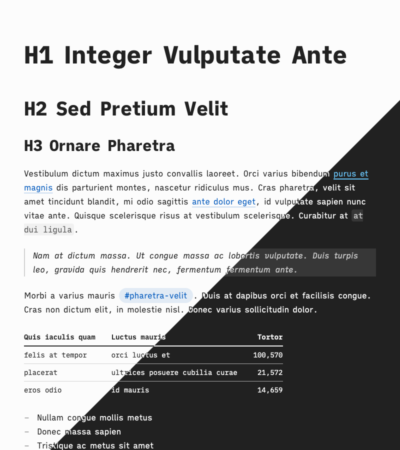

# Markdown Utilities

Tools for editing, rendering and exporting Markdown files.

## Markdown Setup

On Mac: [Atom](https://atom.io/) for editing,  [Marked](https://marked2app.com/) for rendering. [Markdown Tables generator](https://www.tablesgenerator.com/markdown_tables) for table-heavy documents.

On iOS/Android: [iA Writer](https://ia.net/writer).

Atom packages, not required but convenient:

- [document-outline](https://atom.io/packages/document-outline)
- [folding-markdown](https://atom.io/packages/folding-markdown)
- [markdown-table-editor](https://atom.io/packages/markdown-table-editor)
- [smart-quotes-plus](https://atom.io/packages/smart-quotes-plus)
- [wordcount](https://atom.io/packages/wordcount)

## Stylesheets

Adding stylesheets to Marked: `Marked 2` → `Preferences` → `Style`.

<!-- The stylesheets haven't been tested in other tools. However they're generic CSS and could be reused elsewhere, provided the Marked-specific `#wrapper` selectors are removed. -->

### Tetra

- High legibility, low strain style for long-form reading
- Good print support
- High contrast mode support
- Fonts: [iA Writer Mono](https://github.com/iaolo/iA-Fonts/tree/master/iA%20Writer%20Mono), [iA Writer Quattro](https://github.com/iaolo/iA-Fonts/tree/master/iA%20Writer%20Quattro)

### UXASF1

- Sans-serif style, with big text baseline and even bigger titles; used to render [UXA documents](https://github.com/nWODT-Cobalt/uxa)
- High contrast mode support
- Fonts: [Inter](https://rsms.me/inter/), [iA Writer Mono](https://github.com/iaolo/iA-Fonts/tree/master/iA%20Writer%20Mono)

### Older Stylesheets

- Not updated since 2015
- Godspeed (fonts: [Source Sans](https://fonts.google.com/specimen/Source+Sans+Pro), [Brush Up Too](https://www.myfonts.com/fonts/pintassilgo/brush-up/too/), paid)
- New Modern (fonts: [Open Sans](https://fonts.google.com/specimen/Open+Sans))
- Torpedo (fonts: [Open Sans](https://fonts.google.com/specimen/Open+Sans), [Cinta](https://www.myfonts.com/fonts/tipo-pepel/cinta/), paid)
- Vostok (fonts: [PT Serif, PT Sans and PT Sans Narrow](https://company.paratype.com/pt-sans-pt-serif))

## Resources

Sample documents for development and testing.

- `Short Specimen`: sample document of common Markdown tags; used to make the previews for this readme
- `Long Specimen`: sample document of almost all MultiMarkdown tags, for more exhaustive work. The first half prints tags for completeness check, the second one prints long form text for typographic rythm check.

Previews are processed (e.g. cropped) in a [private Figma document](https://www.figma.com/file/lLZWGpxAc71dB5p8mI8Lkn/Markdown-Utilities).
